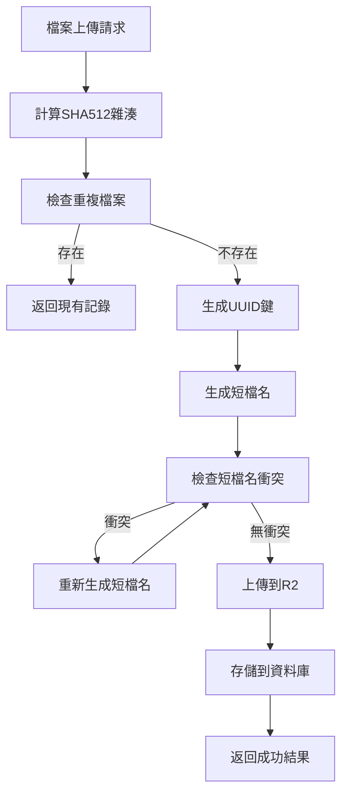
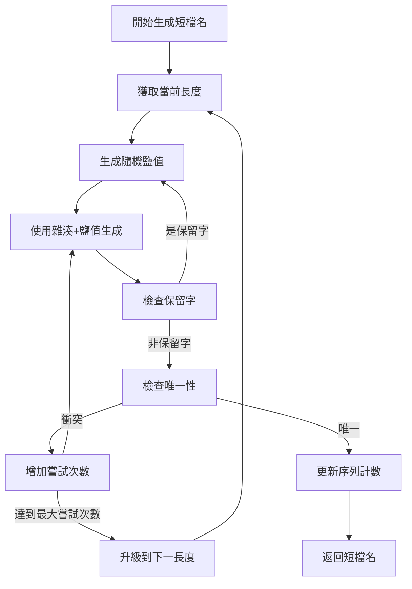
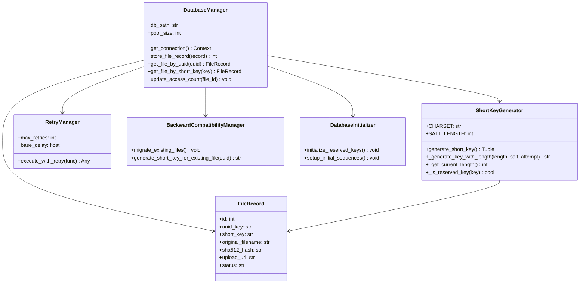

# SQLite 資料庫架構設計文件

## 概述

本文件詳述了 uploadR2 專案的 SQLite 資料庫架構設計，包括短檔名生成算法、資料表結構、索引優化、以及與現有 SHA512 雜湊機制的整合策略。

## 設計目標

1. **防猜測性**：使用加密安全的隨機生成和鹽值，防止檔案數量被猜測
2. **短位數維持**：從4位開始，盡可能維持短的檔名長度
3. **向後相容**：保留現有 SHA512 UUID 作為主要標識，短檔名作為公開別名
4. **高效能**：優化索引設計和查詢效能
5. **可擴展性**：模組化設計，易於擴展功能

## 1. 資料表設計

### 1.1 主要資料表：file_records

```sql
-- 檔案記錄主表
CREATE TABLE file_records (
    -- 主鍵和基本標識
    id INTEGER PRIMARY KEY AUTOINCREMENT,
    uuid_key TEXT NOT NULL UNIQUE,              -- SHA512 雜湊轉換的UUID（主要標識）
    short_key TEXT UNIQUE,                      -- 短檔名（公開別名）
    
    -- 檔案基本資訊
    original_filename TEXT NOT NULL,            -- 原始檔名
    file_extension TEXT NOT NULL,               -- 副檔名（含.）
    file_size INTEGER NOT NULL,                 -- 檔案大小（bytes）
    mime_type TEXT NOT NULL,                    -- MIME類型
    
    -- 雜湊和校驗
    sha512_hash TEXT NOT NULL UNIQUE,           -- 完整SHA512雜湊值
    hash_algorithm TEXT NOT NULL DEFAULT 'sha512',  -- 雜湊算法
    
    -- 上傳資訊
    r2_object_key TEXT NOT NULL,               -- R2中的對象鍵
    upload_url TEXT NOT NULL,                  -- 完整的訪問URL
    upload_timestamp DATETIME NOT NULL DEFAULT CURRENT_TIMESTAMP,
    
    -- 短檔名生成資訊
    short_key_length INTEGER,                  -- 短檔名長度
    short_key_generation_salt TEXT,            -- 生成時使用的鹽值
    short_key_created_at DATETIME,             -- 短檔名創建時間
    
    -- 檔案狀態
    status TEXT NOT NULL DEFAULT 'active',     -- active, deleted, archived
    access_count INTEGER DEFAULT 0,            -- 訪問次數統計
    last_accessed_at DATETIME,                 -- 最後訪問時間
    
    -- 元數據
    metadata TEXT,                             -- JSON格式的額外元數據
    tags TEXT,                                 -- 標籤（JSON數組）
    
    -- 時間戳
    created_at DATETIME NOT NULL DEFAULT CURRENT_TIMESTAMP,
    updated_at DATETIME NOT NULL DEFAULT CURRENT_TIMESTAMP
);
```

### 1.2 短檔名序列表：short_key_sequences

```sql
-- 短檔名序列管理表
CREATE TABLE short_key_sequences (
    id INTEGER PRIMARY KEY AUTOINCREMENT,
    key_length INTEGER NOT NULL UNIQUE,        -- 檔名長度（4, 5, 6...）
    current_sequence INTEGER NOT NULL DEFAULT 0,  -- 當前序號
    max_possible INTEGER NOT NULL,             -- 該長度的最大可能數量
    exhausted BOOLEAN NOT NULL DEFAULT FALSE,   -- 是否已用完
    created_at DATETIME NOT NULL DEFAULT CURRENT_TIMESTAMP,
    updated_at DATETIME NOT NULL DEFAULT CURRENT_TIMESTAMP
);
```

### 1.3 短檔名保留表：reserved_short_keys

```sql
-- 保留的短檔名表（避免生成系統保留字）
CREATE TABLE reserved_short_keys (
    id INTEGER PRIMARY KEY AUTOINCREMENT,
    short_key TEXT NOT NULL UNIQUE,
    reason TEXT NOT NULL,                      -- 保留原因
    created_at DATETIME NOT NULL DEFAULT CURRENT_TIMESTAMP
);
```

### 1.4 檔案操作日誌：file_operation_logs

```sql
-- 檔案操作日誌表
CREATE TABLE file_operation_logs (
    id INTEGER PRIMARY KEY AUTOINCREMENT,
    file_record_id INTEGER NOT NULL,
    operation_type TEXT NOT NULL,              -- upload, access, delete, update
    operation_details TEXT,                    -- JSON格式的操作詳情
    client_ip TEXT,                           -- 客戶端IP
    user_agent TEXT,                          -- 用戶代理
    timestamp DATETIME NOT NULL DEFAULT CURRENT_TIMESTAMP,
    
    FOREIGN KEY (file_record_id) REFERENCES file_records(id)
);
```

## 2. 索引設計

```sql
-- 主要查詢索引
CREATE INDEX idx_file_records_uuid_key ON file_records(uuid_key);
CREATE INDEX idx_file_records_short_key ON file_records(short_key);
CREATE INDEX idx_file_records_sha512_hash ON file_records(sha512_hash);
CREATE INDEX idx_file_records_status ON file_records(status);
CREATE INDEX idx_file_records_upload_timestamp ON file_records(upload_timestamp);

-- 複合索引
CREATE INDEX idx_file_records_status_timestamp ON file_records(status, upload_timestamp);
CREATE INDEX idx_file_records_extension_status ON file_records(file_extension, status);

-- 短檔名相關索引
CREATE INDEX idx_short_key_sequences_length ON short_key_sequences(key_length);
CREATE INDEX idx_reserved_short_keys_key ON reserved_short_keys(short_key);

-- 操作日誌索引
CREATE INDEX idx_file_operation_logs_file_id ON file_operation_logs(file_record_id);
CREATE INDEX idx_file_operation_logs_timestamp ON file_operation_logs(timestamp);
CREATE INDEX idx_file_operation_logs_operation_type ON file_operation_logs(operation_type);
```

## 3. 觸發器設計

```sql
-- 更新 updated_at 時間戳觸發器
CREATE TRIGGER update_file_records_timestamp 
    AFTER UPDATE ON file_records
    FOR EACH ROW
BEGIN
    UPDATE file_records SET updated_at = CURRENT_TIMESTAMP WHERE id = NEW.id;
END;

CREATE TRIGGER update_short_key_sequences_timestamp 
    AFTER UPDATE ON short_key_sequences
    FOR EACH ROW
BEGIN
    UPDATE short_key_sequences SET updated_at = CURRENT_TIMESTAMP WHERE id = NEW.id;
END;

-- 訪問計數更新觸發器
CREATE TRIGGER update_access_count
    AFTER INSERT ON file_operation_logs
    FOR EACH ROW
    WHEN NEW.operation_type = 'access'
BEGIN
    UPDATE file_records 
    SET access_count = access_count + 1,
        last_accessed_at = CURRENT_TIMESTAMP
    WHERE id = NEW.file_record_id;
END;

-- 短檔名序列耗盡檢查觸發器
CREATE TRIGGER check_sequence_exhaustion
    AFTER UPDATE ON short_key_sequences
    FOR EACH ROW
    WHEN NEW.current_sequence >= NEW.max_possible
BEGIN
    UPDATE short_key_sequences 
    SET exhausted = TRUE 
    WHERE id = NEW.id;
END;
```

## 4. DatabaseManager 類別設計

### 4.1 核心類別結構

```python
from typing import Optional, Dict, Any, List, Tuple
import sqlite3
import threading
import secrets
import string
from contextlib import contextmanager
from dataclasses import dataclass
from datetime import datetime
import json

@dataclass
class FileRecord:
    """檔案記錄數據類"""
    id: Optional[int] = None
    uuid_key: str = ""
    short_key: Optional[str] = None
    original_filename: str = ""
    file_extension: str = ""
    file_size: int = 0
    mime_type: str = ""
    sha512_hash: str = ""
    hash_algorithm: str = "sha512"
    r2_object_key: str = ""
    upload_url: str = ""
    upload_timestamp: Optional[datetime] = None
    short_key_length: Optional[int] = None
    short_key_generation_salt: Optional[str] = None
    short_key_created_at: Optional[datetime] = None
    status: str = "active"
    access_count: int = 0
    last_accessed_at: Optional[datetime] = None
    metadata: Optional[Dict[str, Any]] = None
    tags: Optional[List[str]] = None
    created_at: Optional[datetime] = None
    updated_at: Optional[datetime] = None

class DatabaseManager:
    """SQLite 資料庫管理器"""
    
    def __init__(self, db_path: str = "data/uploadr2.db", pool_size: int = 10):
        self.db_path = db_path
        self.pool_size = pool_size
        self._local = threading.local()
        self._lock = threading.RLock()
        self._initialize_database()
    
    @contextmanager
    def get_connection(self):
        """獲取資料庫連接（連接池模式）"""
        if not hasattr(self._local, 'connection'):
            self._local.connection = sqlite3.connect(
                self.db_path,
                timeout=30.0,
                check_same_thread=False
            )
            self._local.connection.row_factory = sqlite3.Row
            self._local.connection.execute("PRAGMA foreign_keys = ON")
            self._local.connection.execute("PRAGMA journal_mode = WAL")
            self._local.connection.execute("PRAGMA synchronous = NORMAL")
        
        try:
            yield self._local.connection
        except Exception as e:
            self._local.connection.rollback()
            raise
```

### 4.2 主要方法

```python
    def store_file_record(self, record: FileRecord) -> int:
        """存儲檔案記錄"""
        with self._lock:
            with self.get_connection() as conn:
                cursor = conn.cursor()
                
                try:
                    # 生成短檔名（如果需要）
                    if record.short_key is None:
                        record.short_key = self._generate_short_key(cursor)
                    
                    # 插入記錄
                    cursor.execute("""
                        INSERT INTO file_records (
                            uuid_key, short_key, original_filename, file_extension,
                            file_size, mime_type, sha512_hash, hash_algorithm,
                            r2_object_key, upload_url, upload_timestamp,
                            short_key_length, short_key_generation_salt, short_key_created_at,
                            status, metadata, tags
                        ) VALUES (?, ?, ?, ?, ?, ?, ?, ?, ?, ?, ?, ?, ?, ?, ?, ?, ?)
                    """, (
                        record.uuid_key, record.short_key, record.original_filename,
                        record.file_extension, record.file_size, record.mime_type,
                        record.sha512_hash, record.hash_algorithm, record.r2_object_key,
                        record.upload_url, record.upload_timestamp or datetime.now(),
                        record.short_key_length, record.short_key_generation_salt,
                        record.short_key_created_at, record.status,
                        json.dumps(record.metadata) if record.metadata else None,
                        json.dumps(record.tags) if record.tags else None
                    ))
                    
                    file_id = cursor.lastrowid
                    conn.commit()
                    
                    # 記錄操作日誌
                    self._log_operation(cursor, file_id, "upload", {
                        "original_filename": record.original_filename,
                        "file_size": record.file_size
                    })
                    
                    conn.commit()
                    return file_id
                    
                except sqlite3.IntegrityError as e:
                    conn.rollback()
                    if "uuid_key" in str(e):
                        raise DuplicateFileError(f"文件已存在: {record.uuid_key}")
                    elif "short_key" in str(e):
                        # 短檔名衝突，重試
                        return self._retry_with_new_short_key(record)
                    else:
                        raise DatabaseError(f"數據庫完整性錯誤: {e}")
    
    def get_file_by_uuid(self, uuid_key: str) -> Optional[FileRecord]:
        """通過UUID鍵獲取檔案記錄"""
        
    def get_file_by_short_key(self, short_key: str) -> Optional[FileRecord]:
        """通過短檔名獲取檔案記錄"""
        
    def check_duplicate_by_hash(self, sha512_hash: str) -> Optional[FileRecord]:
        """通過雜湊值檢查重複檔案"""
```

## 5. 短檔名生成算法

### 5.1 生成器設計

```python
class ShortKeyGenerator:
    """短檔名生成器"""
    
    # 字符集：數字 + 小寫字母 + 大寫字母 (62個字符)
    CHARSET = string.digits + string.ascii_lowercase + string.ascii_uppercase
    SALT_LENGTH = 16
    
    def __init__(self, db_manager: DatabaseManager):
        self.db_manager = db_manager
        self._lock = threading.RLock()
    
    def generate_short_key(self) -> Tuple[str, int, str]:
        """
        生成短檔名
        
        Returns:
            Tuple[str, int, str]: (短檔名, 長度, 使用的鹽值)
        """
        with self._lock:
            with self.db_manager.get_connection() as conn:
                cursor = conn.cursor()
                
                # 獲取當前應該使用的長度
                current_length = self._get_current_length(cursor)
                
                # 生成鹽值
                salt = secrets.token_hex(self.SALT_LENGTH)
                
                # 嘗試生成短檔名
                max_attempts = 100
                for attempt in range(max_attempts):
                    short_key = self._generate_key_with_length(current_length, salt, attempt)
                    
                    # 檢查是否被保留
                    if self._is_reserved_key(cursor, short_key):
                        continue
                    
                    # 檢查是否已存在
                    if not self._key_exists(cursor, short_key):
                        # 更新序列
                        self._increment_sequence(cursor, current_length)
                        conn.commit()
                        return short_key, current_length, salt
                
                # 如果當前長度無法生成，升級到下一個長度
                return self._upgrade_to_next_length(cursor)
```

### 5.2 關鍵算法

```python
    def _generate_key_with_length(self, length: int, salt: str, attempt: int) -> str:
        """使用指定長度生成鍵"""
        # 結合鹽值和嘗試次數創建種子
        seed = f"{salt}:{attempt}:{secrets.token_hex(8)}"
        
        # 使用加密安全的隨機生成
        result = ""
        for i in range(length):
            # 為每個位置生成獨立的隨機索引
            random_bytes = secrets.token_bytes(4)
            index = int.from_bytes(random_bytes, 'big') % len(self.CHARSET)
            result += self.CHARSET[index]
        
        return result
    
    def _get_current_length(self, cursor: sqlite3.Cursor) -> int:
        """獲取當前應該使用的長度"""
        cursor.execute("""
            SELECT key_length FROM short_key_sequences 
            WHERE NOT exhausted 
            ORDER BY key_length ASC 
            LIMIT 1
        """)
        
        row = cursor.fetchone()
        if row:
            return row[0]
        
        # 如果沒有可用長度，創建新的長度記錄
        return self._create_new_length_sequence(cursor, 4)  # 從4開始
    
    def _calculate_max_possible(self, length: int) -> int:
        """計算指定長度的最大可能組合數"""
        # 預留一些組合給系統保留字
        total_combinations = len(self.CHARSET) ** length
        reserved_ratio = 0.001  # 預留0.1%
        return int(total_combinations * (1 - reserved_ratio))
```

## 6. 錯誤處理和重試機制

### 6.1 異常類設計

```python
class DatabaseError(Exception):
    """資料庫錯誤基類"""
    pass

class DuplicateFileError(DatabaseError):
    """重複檔案錯誤"""
    pass

class ShortKeyExhaustedError(DatabaseError):
    """短檔名耗盡錯誤"""
    pass

class ShortKeyCollisionError(DatabaseError):
    """短檔名衝突錯誤"""
    pass
```

### 6.2 重試管理器

```python
class RetryManager:
    """重試管理器"""
    
    def __init__(self, max_retries: int = 3, base_delay: float = 0.1):
        self.max_retries = max_retries
        self.base_delay = base_delay
    
    async def execute_with_retry(self, func, *args, **kwargs):
        """帶重試的執行函數"""
        last_exception = None
        
        for attempt in range(self.max_retries + 1):
            try:
                return await func(*args, **kwargs)
            except (sqlite3.OperationalError, sqlite3.DatabaseError) as e:
                last_exception = e
                if attempt < self.max_retries:
                    delay = self.base_delay * (2 ** attempt)
                    await asyncio.sleep(delay)
                    continue
                break
            except Exception as e:
                # 非資料庫錯誤不重試
                raise e
        
        raise DatabaseError(f"操作失敗，已重試 {self.max_retries} 次") from last_exception
```

## 7. 整合策略

### 7.1 向後相容性方案

```python
class BackwardCompatibilityManager:
    """向後相容性管理器"""
    
    def __init__(self, db_manager: DatabaseManager):
        self.db_manager = db_manager
    
    def migrate_existing_files(self, batch_size: int = 1000):
        """遷移現有檔案到新的資料庫結構"""
        # 1. 掃描現有的檔案記錄
        # 2. 為沒有短檔名的檔案生成短檔名
        # 3. 批量更新資料庫
        pass
    
    def generate_short_key_for_existing_file(self, uuid_key: str) -> Optional[str]:
        """為現有檔案生成短檔名"""
        with self.db_manager.get_connection() as conn:
            cursor = conn.cursor()
            
            # 檢查檔案是否存在且沒有短檔名
            cursor.execute("""
                SELECT id FROM file_records 
                WHERE uuid_key = ? AND short_key IS NULL
            """, (uuid_key,))
            
            if not cursor.fetchone():
                return None
            
            # 生成短檔名
            generator = ShortKeyGenerator(self.db_manager)
            short_key, length, salt = generator.generate_short_key()
            
            # 更新記錄
            cursor.execute("""
                UPDATE file_records 
                SET short_key = ?, short_key_length = ?, 
                    short_key_generation_salt = ?, short_key_created_at = ?
                WHERE uuid_key = ?
            """, (short_key, length, salt, datetime.now(), uuid_key))
            
            conn.commit()
            return short_key
```

### 7.2 資料庫初始化策略

```python
class DatabaseInitializer:
    """資料庫初始化器"""
    
    def __init__(self, db_manager: DatabaseManager):
        self.db_manager = db_manager
    
    def initialize_reserved_keys(self):
        """初始化保留關鍵字"""
        reserved_keys = [
            ("api", "API端點保留"),
            ("admin", "管理界面保留"),
            ("www", "網站根目錄保留"),
            ("help", "幫助頁面保留"),
            ("test", "測試用途保留"),
            ("null", "空值保留"),
            ("temp", "臨時檔案保留"),
            # 添加更多保留字...
        ]
        
        with self.db_manager.get_connection() as conn:
            cursor = conn.cursor()
            
            for key, reason in reserved_keys:
                cursor.execute("""
                    INSERT OR IGNORE INTO reserved_short_keys (short_key, reason)
                    VALUES (?, ?)
                """, (key, reason))
            
            conn.commit()
```

## 8. 流程圖

### 8.1 檔案上傳流程



### 8.2 短檔名生成流程



## 9. 類別關係圖



## 10. 實作整合點

### 10.1 與現有程式碼整合

1. **修改 `hash_utils.py`**：
   - 新增 `generate_short_key()` 方法
   - 整合資料庫存儲邏輯
   - 保持現有雜湊功能不變

2. **修改 `r2_uploader.py`**：
   - 在上傳成功後調用資料庫存儲
   - 支援短檔名URL生成
   - 整合重複檔案檢查邏輯

3. **修改 `batch_processor.py`**：
   - 整合資料庫檢查重複檔案邏輯
   - 記錄處理日誌到資料庫
   - 支援短檔名功能

4. **擴展 `config.py`**：
   - 新增資料庫相關配置項
   - 新增短檔名相關配置項

### 10.2 配置擴展

```python
# 在 config.py 中新增配置項
class Config(BaseModel):
    # ... 現有配置 ...
    
    # 資料庫配置
    database_path: str = Field(default="data/uploadr2.db", description="SQLite資料庫路徑")
    database_pool_size: int = Field(default=10, ge=1, le=50, description="資料庫連接池大小")
    
    # 短檔名配置
    enable_short_keys: bool = Field(default=True, description="是否啟用短檔名")
    short_key_min_length: int = Field(default=4, ge=3, le=10, description="短檔名最小長度")
    short_key_charset: str = Field(default="alphanumeric_mixed", description="字符集類型")
    
    # 安全配置
    short_key_salt_length: int = Field(default=16, ge=8, le=32, description="鹽值長度")
    max_short_key_attempts: int = Field(default=100, ge=10, le=1000, description="短檔名生成最大嘗試次數")
```

## 11. 效能考量

### 11.1 查詢優化

- 主要查詢路徑都有對應索引
- 使用複合索引優化常見查詢組合
- WAL 模式提升並發讀寫效能

### 11.2 連接池管理

- 使用執行緒本地存儲避免連接競爭
- 合理的連接池大小配置
- 自動連接回收和錯誤處理

### 11.3 記憶體使用

- 分批處理大量資料遷移
- JSON 欄位僅存儲必要的元數據
- 適當的快取策略

## 12. 安全考量

### 12.1 短檔名安全性

- 使用加密安全的隨機生成器
- 鹽值機制防止模式推測
- 保留字機制避免系統衝突

### 12.2 資料庫安全

- 參數化查詢防止SQL注入
- 適當的權限控制
- 敏感資料加密存儲

## 結論

本設計提供了一個完整、安全且高效的 SQLite 資料庫架構，滿足了防猜測性、短位數維持、向後相容性等所有要求。通過模組化的設計，系統易於擴展和維護，同時保持了與現有程式碼的良好整合性。

下一步將進入程式碼實作階段，按照此設計文件逐步實現各個組件。